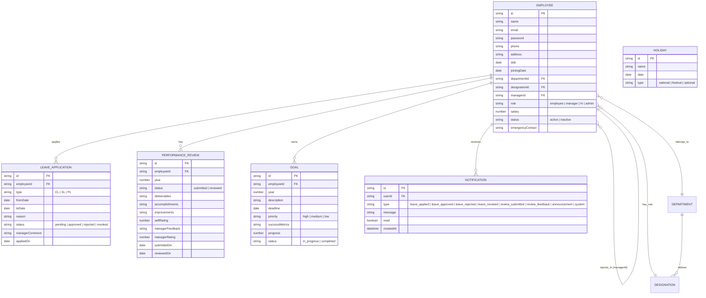

## Rev Workforce – HR Management System

Rev Workforce is a role-based Human Resource Management (HRM) application implemented as a React + Vite single-page app. It supports **Employees**, **Managers**, **HR**, and **Admins** for:

- **Authentication & Profiles**: login by employee ID/email, profile editing, password change, session timeout.
- **Leave Management**: balances, applications, approvals, cancellations, calendars, company holidays.
- **Performance Management**: annual reviews, goals, manager feedback and ratings.
- **HR & Admin**: employee records, leave policies, holiday calendar, departments/designations, announcements, audit log, analytics and reports.

### Running the application

- **Install dependencies**

```bash
npm install
```

- **Start the dev server**

```bash
npm run dev
```

Then open the printed `http://localhost:xxxx` URL in your browser.

### Demo credentials

- **Employee**: `EMP003` / `password123`
- **Manager**: `EMP002` / `password123`
- **HR**: `EMP007` / `hr@1234`
- **Admin**: `EMP001` / `admin123`

You can also log in using the employee email addresses (e.g. `james.carter@revworkforce.com`) with the same passwords.

### High-level architecture

- **UI Layer (React + Vite)**
  - Pages under `src/pages/**` for each role and module (employee, manager, HR, admin).
  - Shared layout and components in `src/components/**` (`Layout`, `Sidebar`, `Header`, `Modal`, `Avatar`, `Badge`).
- **Session & Auth Layer**
  - `src/context/AuthContext.jsx` – manages logged-in user, session storage, inactivity timeout, and unread notifications.
- **Domain / Data Layer**
  - `src/store/dataStore.js` – in-memory + `localStorage` backed “database” with:
    - Employees, departments, designations
    - Leave balances, applications, holidays
    - Performance reviews, goals
    - Notifications and announcements
  - All business operations (login, CRUD, approvals, reviews, goals, notifications, admin actions) are implemented here.

### ERD (Entity Relationship Diagram)

Conceptual ERD for the in-memory data model (Mermaid syntax):



### Application architecture (layered)

```mermaid
graph LR
  A[UI / Pages\nReact Router routes] --> B[Shared Layout & Components\nHeader / Sidebar / Modals]
  B --> C[Auth Context\n(session, user, notifications)]
  C --> D[Data Store API\nlogin, employees, leaves, reviews, goals, notifications]
  D --> E[In-memory Store\n+ localStorage persistence]

  subgraph Employees / Managers / HR / Admin
    A
  end
```

This structure keeps all domain rules (leave validation, balances, approvals, performance flows, notifications, admin operations) in a single data store layer, making it straightforward to swap the in-memory store for real APIs or microservices in a future phase.
